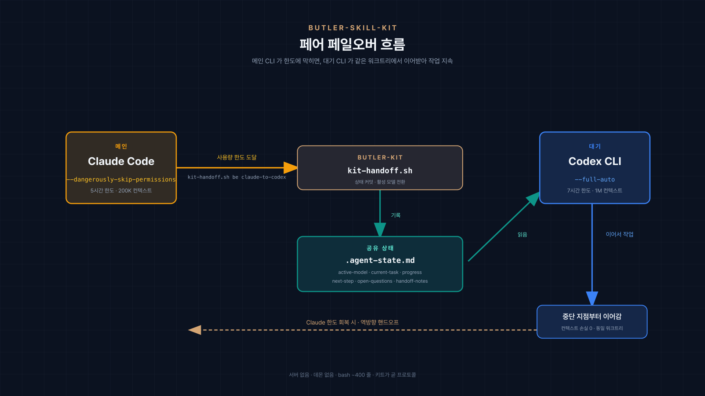
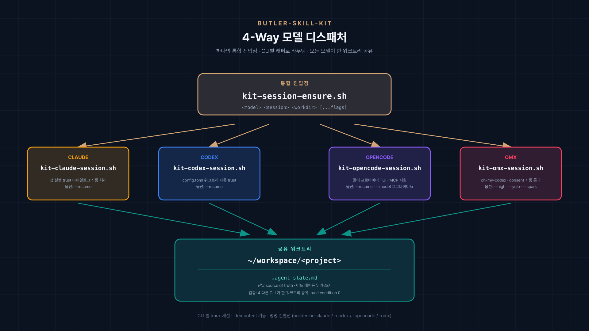
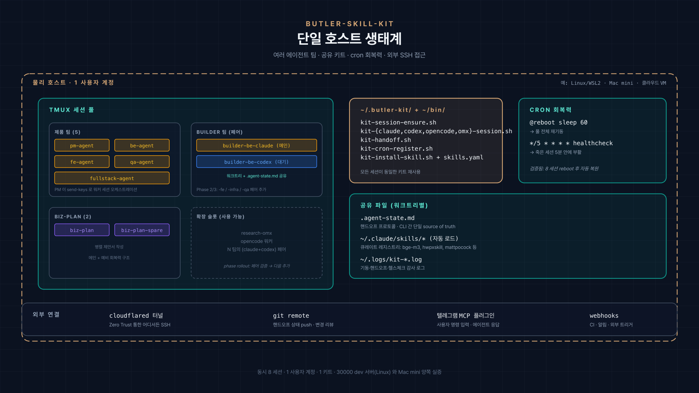

<p align="center">
  
</p>

<h1 align="center">butler-skill-kit</h1>

<p align="center">
  <a href="README.md">English</a> ·
  <a href="README-KO.md"><strong>한국어</strong></a>
</p>

<p align="center">
  <strong>Claude Code + Codex CLI 에이전트의 Failover 오케스트레이션.</strong><br/>
  한쪽이 rate limit 맞으면 다른 쪽이 이어받음 — 같은 워크트리, 같은 컨텍스트, 같은 작업.
</p>

<p align="center">
  <a href="LICENSE"></a>
  <a href="https://github.com/tmux/tmux"></a>
  
  
</p>

<p align="center">
  <a href="#quickstart-빠른-시작">Quickstart</a> ·
  <a href="#9가지-페인포인트-내장-fix">페인포인트</a> ·
  <a href="#아키텍처">아키텍처</a> ·
  <a href="#agent-statemd--상태-프로토콜">상태 프로토콜</a> ·
  <a href="#컴패니언-agent-factory">컴패니언</a>
</p>

---

## 누구를 위한 도구인가

- **개발자 1인** 이 Claude Code 를 밤새 돌리는 경우
- **인디 해커** 가 Codex CLI 토큰을 빠르게 소진하는 프로덕션 작업
- **소규모 팀** 이 공유 dev 서버에서 여러 에이전트 운용
- 리팩토링 80% 진행 중에 Claude/Codex 가 멈춰버린 경험이 있는 누구나

rate limit 한 번도 안 맞아본 사람은 왜 이게 필요한지 의아할 거고, 한 번 맞아본 사람은 바로 알 거예요.

## 문제

Claude Code 를 밤새 돌렸어요. 작업이 잘 진행되고 있었어요. 아침에 일어나니:

```
Hit rate limit. Resets in 4h 17m.
```

에이전트 멈춤. 컨텍스트 사라짐. 밤샘 작업이 "점심까지 대기" 가 됨.

Codex CLI 도 마찬가지. 단일 CLI 에이전트 셋업 전부 마찬가지. 그게 빈틈이에요.

## 해결

CLI 세션 한 쌍 — 하나는 Claude, 하나는 Codex — 가 같은 git 워크트리를 공유. 둘 중 하나가 한계에 부딪히면 깔끔한 핸드오프:



Claude 가 돌아오면 reverse handoff 실행. Codex 가 상태 확정 커밋 → Claude 가 재개.

**서버 없음. 데몬 없음. bash 약 400줄.** 모든 스크립트 10분이면 다 읽음.

---

## 사용 사례

### 1 · 새벽 3시에 죽지 않는 밤샘 리팩토링

프로젝트에 Claude/Codex 페어 셋업. healthcheck cron 등록. 자러 가기. Claude 가 cap 맞으면 Codex 가 이어받고, Claude 복귀 시 다시 인계받음. 일어나니 작업이 *완료* 되어 있음.

### 2 · 며칠 걸리는 프로덕션 마이그레이션

client-v1 → client-v2 컷오버. 며칠 걸림. 각 단계 검증·커밋·롤백 가능해야 함. 페어 패턴 + `.agent-state.md` 가 *누가 언제 무엇을 했는지* 모델 전환을 넘어 연속 로그로 남김.

### 3 · 공유 dev 박스에서 멀티 에이전트 팀

단계적 롤아웃. 한 역할 페어 (`builder-be-claude` + `builder-be-codex`) 부터. 핸드오프 검증. 다음 페어 추가. 네이밍 규칙 + 워크트리 분리가 가장 흔한 함정 (두 에이전트가 같은 파일에서 충돌) 을 방지.

### 4 · 서버 재부팅 후 수동 reattach 없이 복구

`kit-cron-register.sh reboot ~/bin/your-spawn.sh` 등록 → 재부팅 신경 안 써도 됨. tmux 세션 자동 복귀. Claude/Codex 는 `-c` / `--last` 로 직전 세션 재개. 상태 파일도 그대로.

### 5 · 필요 없는 병렬 모델 비용 안 내기

Claude 가 작업하는 동안 Codex 는 idle (API 호출 X). 전환은 on-demand, always-on 아님. 우리 셋업 실측 비용: 단일 Claude 의 ~1.2배, 2배가 아님.

---

## 각 페인포인트 fix 의 사연

아래 9가지 fix 는 이론에서 나온 게 아니라, 한 프로덕션 셋업이 *각 항목 한 번씩 우리를 물고 늘어진* 결과:

1. **Trust 다이얼로그**: 스크립트로 9개 세션을 밤새 띄움. 아침에 와보니 9개 다 폴더 신뢰 확인 프롬프트에서 멈춤. 약 2시간 손해. Fix.
2. **Codex sandbox**: Codex 의 "command failed; retry without sandbox?" 프롬프트가 핸드오프를 조용히 멈춤. 이제 세션 부팅 전에 워크트리별 config 자동 설정.
3. **/var/log 권한**: cron 스크립트가 sudo 에선 동작, 일반 유저론 조용히 실패. 로그 사라짐. `~/.logs/` fallback 의 어려운 깨달음.
4. **`-c` / `--last` 첫 실행**: 이전 세션 없는데 resume 플래그 → tmux 세션 즉시 종료. 헷갈림. 이제: first-run 감지 후 플래그 생략.
5. **Paste-mode Enter**: 멀티라인 프롬프트 send-keys 시 첫 Enter 가 paste 일부로 처리, submit 안 됨. 영원히 대기. Enter 두 번 전송.
6. **워크트리 존재**: 부분 셋업 후 spawn 재실행 시 `git worktree add` 가 기존 디렉터리 보고 폭발. Idempotent 체크.
7. **Cron 중복**: 같은 `@reboot` 라인 세 번 추가하고 못 알아챔. 부팅 시 동일 작업 3개 실행. grep-then-skip.
8. **hermes vs tmux 이름 충돌**: tmux 세션 이름을 hermes 프로파일 이름과 같게 두면 스크립트에서 같은 것으로 오해받음. 강한 prefix 분리 (`builder-*` vs hermes 프로파일) 로 해결.
9. **재부팅 회복**: 서버 재부팅 한 번에 5개 활성 세션 증발. 알람 없어서 모름. 2-레이어 cron: `@reboot` + 5분 healthcheck. 둘 다 idempotent spawn 호출. 그 이후로 매번 복구.

---

## Quickstart 빠른 시작

### 1 · 에이전트가 동작할 머신에 설치

```bash
git clone https://github.com/data-sketchers/butler-skill-kit.git
cd butler-skill-kit

# 원격 설치 (기본 dry-run)
bash install.sh --host you@your.server --port 22 --key ~/.ssh/id_ed25519

# 원격 설치 (실제)
bash install.sh --host you@your.server --port 22 --key ~/.ssh/id_ed25519 --apply
```

타겟 머신의 `~/bin/` 에 `kit-*.sh`, `~/.butler-kit/` 에 templates/docs 배치.

로컬 단독: `ln -sf $(pwd)/scripts/* ~/bin/`.

### 2 · 단일 에이전트 기동

```bash
~/bin/kit-session-ensure.sh claude my-agent ~/workspace/my-project
```

`my-agent` 라는 tmux 세션 부팅, `~/workspace/my-project` 에서 Claude Code 시작, **trust-folder 다이얼로그 자동 승인** — 옆에서 지킬 필요 없음.

### 3 · 페어 (Claude + Codex) 기동

```bash
~/bin/kit-session-ensure.sh claude builder-be-claude ~/workspace/be
~/bin/kit-session-ensure.sh codex  builder-be-codex  ~/workspace/be
```

tmux 세션 둘, 같은 워크트리. Claude 가 토큰 있을 때 작업, Codex 는 살아있되 idle.

### 4 · Claude 가 한계 맞으면 Handoff

```bash
~/bin/kit-handoff.sh builder-be claude-to-codex ~/workspace/be
```

Claude 가 진행 상태를 `.agent-state.md` (역할의 진실 원천) 에 커밋. Codex 가 읽고 `next-step` 부터 이어감.

Claude 가 reset 되면:

```bash
~/bin/kit-handoff.sh builder-be codex-to-claude ~/workspace/be
```

끝.

---

## 9가지 페인포인트 내장 fix

butler-skill-kit 은 실제 프로덕션 셋업에서 추출. 모든 스크립트가 우리가 부딪힌 *실제* 문제의 fix 를 담음:

| # | 어디서 깨졌나 | kit 가 하는 일 |
|---|--------------|--------------|
| 1 | Claude 첫 실행 "trust this folder?" 다이얼로그 차단 | 자동 감지 후 `'1'` + Enter |
| 2 | Codex sandbox 가 파일 쓰기 interactive 차단 | 워크트리별 `trust_level = "trusted"` 자동 등록 |
| 3 | 일반 유저는 `/var/log/*.log` 권한 거부 | `~/.logs/` 로 fallback |
| 4 | `claude -c` / `codex resume --last` 가 첫 실행에서 즉시 종료 | prior-session 존재 여부 감지 후 플래그 적용 |
| 5 | tmux `send-keys` paste-mode 가 첫 Enter 삼킴 | Enter 두 번 전송 |
| 6 | `git worktree add` 가 기존 디렉터리에 실패 | 사전 존재 체크 |
| 7 | `crontab` 라인 반복 실행 시 중복 | grep 으로 기존 라인 확인 후 skip |
| 8 | hermes 프로파일 이름과 tmux 세션 이름 충돌 | 엄격한 네이밍 컨벤션 |
| 9 | 서버 재부팅이 모든 tmux 세션 죽임 | `@reboot` cron + 5분 healthcheck 둘 다 idempotent spawn 호출 |

상세는 [`docs/pain-fixes.md`](docs/pain-fixes.md).

---

## 아키텍처

```
        ~/bin/                              ~/.butler-kit/
        ├── kit-bootstrap.sh                 ├── docs/
        ├── kit-session-ensure.sh            │   ├── pain-fixes.md
        ├── kit-claude-session.sh            │   ├── codex-sandbox.md
        ├── kit-codex-session.sh             │   └── session-lifecycle.md
        ├── kit-opencode-session.sh          ├── templates/
        ├── kit-omx-session.sh               │   ├── start-claude.sh.tpl
        ├── kit-handoff.sh                   │   ├── start-codex.sh.tpl
        ├── kit-cron-register.sh             │   └── agent-state.md.tpl
        ├── kit-install-skill.sh             └── skills.yaml
        └── kit-log-dir.sh
```

`kit-session-ensure.sh` 가 CLI별 래퍼로 라우팅:



| 모델 | 래퍼 | 비고 |
|------|------|------|
| `claude` | `kit-claude-session.sh` | 첫 실행 trust 다이얼로그 자동 처리 |
| `codex` | `kit-codex-session.sh` | 워크트리별 `trust_level = "trusted"` 자동 등록 |
| `opencode` | `kit-opencode-session.sh` | TUI · `--model provider/model`, `-c` continue 지원 |
| `omx` | `kit-omx-session.sh` | oh-my-codex · `--direct` 로 OMX 자체 tmux 우회 · `--high/--xhigh/--yolo/--madmax/--spark` 플래그 |

한 워크트리 안에서 모델 혼합 가능 — claude + opencode + codex + omx 가 같은 `.agent-state.md` 공유. 두 호스트에 걸쳐 8개 동시 세션으로 프로덕션 검증.

모든 스크립트는 **idempotent**. 100번 실행해도 동일 결과·side effect 없음.

> 참고: 런타임 설치 dir 는 `~/.butler-kit/` 그대로 (간결하고 이름 중복 없음). repo·브랜드는 `butler-skill-kit`.



전체 스택은 한 사용자 계정 · 한 물리 호스트 안에 들어감: 좌측 tmux 세션 풀 (제품 팀 / builder 페어 / biz-plan / 확장 슬롯), 우측 공유 키트 바이너리 + cron 회복력, 하단 cloudflared / git / Telegram MCP / webhooks 외부 연결.

### `.agent-state.md` — 상태 프로토콜

```yaml
last-updated: 2026-04-25T18:30:00Z
active-model: claude
current-task: webbuilder#234
progress: 40%
next-step: Add integration test for findActive() in UserRepositoryTest.kt
open-questions:
  - Should UserRole.DELETED count as active? Asked PM.
handoff-notes: |
  [claude → codex 2026-04-24T18:30]
  Refactored findByEmail(). Test scaffold for findActive() exists.
  Hit 5h cap. Back in ~1h.
```

"활성" 인 에이전트가 이 파일을 갱신. 인계받는 쪽이 읽음. 그게 핸드오프 프로토콜의 전부 — 한 파일, 6개 필드, 스키마 강제 X, 데몬 X.

---

## 단일 에이전트로도 사용 가능

페어 패턴이 필수는 아님. Claude 한 개만 써도 유용:

- Idempotent 세션 spawn — `kit-session-ensure.sh`
- 서버 재부팅 회복 — `kit-cron-register.sh`
- 깔끔한 로그 디렉터리 fallback — `kit-log-dir.sh` (sourceable)
- tmux 컨벤션, scriptable handoff hooks

---

## 여기에 없는 것

의도적으로 좁게 유지:

- N개 에이전트 멀티 모델 라우팅 → [oh-my-codex](https://github.com/Yeachan-Heo/oh-my-codex), [oh-my-openagent](https://github.com/code-yeongyu/oh-my-openagent) 참고
- 호스티드 서버·데몬·MCP 서버
- 웹 UI
- 조직 특화 통합 (이슈 템플릿·Discord 알림 등)

butler-skill-kit 은 의도적으로 작음. 전체 ~400줄 bash + 문서. **한 자리에서 다 읽음.**

---

## 컴패니언: `agent-factory`

butler-skill-kit 은 플러밍. 에이전트 *팀* (PM + backend + frontend + infra + QA) 을 정의하고 GitLab 이슈 템플릿·단계적 롤아웃 게이트까지 원하면 [`agent-factory`](https://github.com/data-sketchers/agent-factory).

(agent-factory 는 v0.1 까지 internal-only. butler-skill-kit 안정화 후 공개 예정.)

---

## 상태

`v0.1.0-alpha` — 단일 프로덕션 셋업 (2026-04-24, 내부 팀 모노레포 Phase 1) 에서 추출. 광범위한 커뮤니티 검증 전. **버그 리포트 환영.**

테스트 환경:

- Linux Ubuntu 22.04 — 주 배포 타겟
- macOS — 로컬 dev (sed 차이 처리됨)
- tmux 3.x
- Claude Code 2.x · Codex CLI 0.12x

---

## 라이선스

[Apache License 2.0](LICENSE) — 사용·포크·배포 가능. 출처 표기만 부탁드립니다.

## 만든 사람

[Data Sketchers](https://data-sketchers.com) — 한국 AI 스타트업, 우리 일상 워크플로우용으로 만들었어요.

이슈·PR 환영. Discussion: [`/discussions`](https://github.com/data-sketchers/butler-skill-kit/discussions) (활성화 후).
